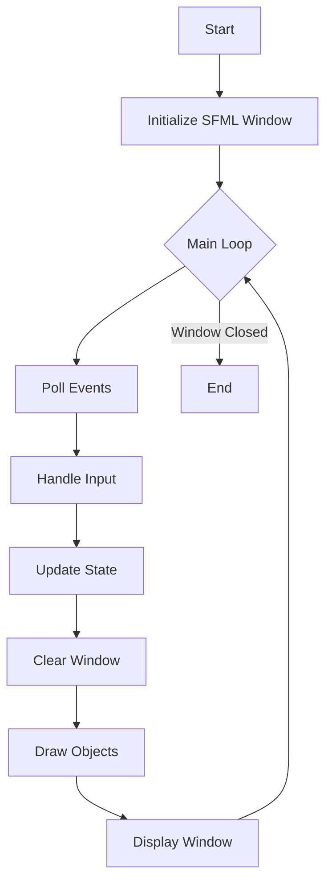

# System Patterns: Paint

## Architecture Overview
The application follows a simple event-driven loop pattern typical for graphical applications using SFML.

## Key Technical Decisions
- **SFML for Graphics**: Chosen for its simplicity and ease of use for 2D graphics.
- **CMake for Build System**: Standard for C++ projects, providing cross-platform compatibility and easy dependency management.
- **Event-Driven Input**: Handling mouse movements and clicks to drive the "painting" logic.

## Component Relationships
- **Main Loop**: Orchestrates the entire application lifecycle.
- **Input Handler**: Translates SFML events into application-specific actions.
- **Renderer**: Responsible for drawing the current state of the canvas to the window.